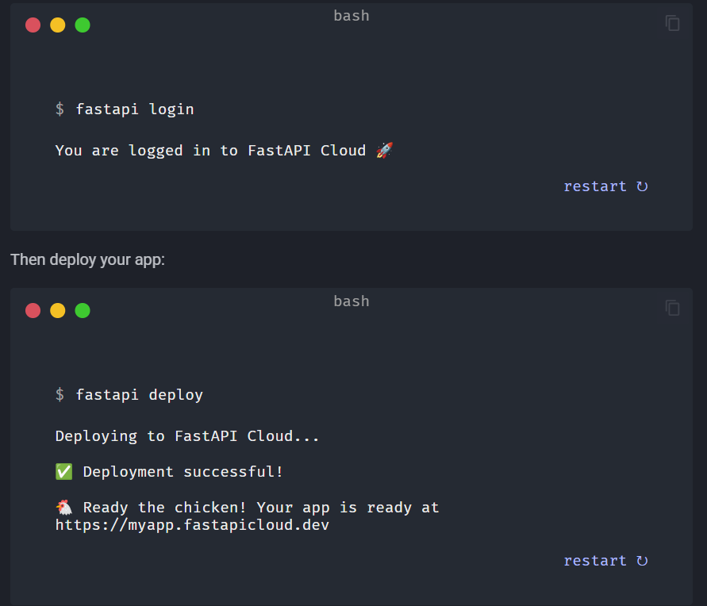

# TomogachiFit



## Project Overview

TomogachiFit is a web application built with modern technologies to deliver a seamless user experience. This repository contains the backend API and supporting infrastructure for the platform.

## Project Structure

```
├── app/                    # Application code
├── data/                   # Data files and resources
├── docs/                   # Documentation
├── requirements.txt        # Python dependencies
├── .env                    # Environment variables (not tracked)
├── .gitignore             # Git ignore rules
└── LICENSE                # Project license
```

## Tech Stack

- **Framework:** FastAPI 0.113.0
- **Validation:** Pydantic 2.8.0
- **Python Version:** 3.x

## Getting Started

### Prerequisites

- Python 3.8 or higher
- Virtual environment support

### Installation

1. **Clone the repository**
   ```bash
   git clone https://github.com/MaksIMMum/TomogachiFit.git
   cd TomogachiFit
   ```

2. **Create and activate a virtual environment**
   ```bash
   python -m venv .venv
   source .venv/Scripts/activate  # On Windows: .venv\Scripts\activate
   ```

3. **Install dependencies**
   ```bash
   pip install -r requirements.txt
   ```

### Running the Application

Start the development server:
```bash
fastapi dev app/main.py
```

The application will be available at `http://localhost:8000`

## Deployment

### Deploy to FastAPI Cloud

1. **Login to FastAPI Cloud**
   ```bash
   fastapi login
   ```

2. **Deploy your application**
   ```bash
   fastapi deploy
   ```

Once deployed successfully, your app will be available at `https://myapp.fastapicloud.dev`

## Development Notes

- **Always activate the virtual environment** before working on the project
- After installing new packages, reactivate the virtual environment to ensure CLI tools use the correct version
- When finished working, deactivate the environment with `deactivate`

For additional setup and development tips, see [useful stuff to remember.md](useful%20stuff%20to%20remember.md)

## License

This project is licensed under the terms specified in the [LICENSE](LICENSE) file.

## Contributing

Contributions are welcome! Please feel free to open issues and pull requests.

---

**Status:** In Development